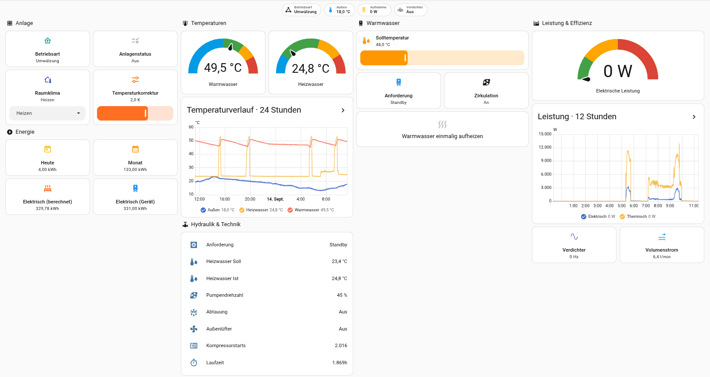

# Home Assistant Integration für REMKO Wärmepumpen

[](https://github.com/fuchsi585/remko_http/releases)
[](https://www.hacs.xyz/)
[](https://github.com/fuchsi585/remko_http/actions/workflows/validate.yml)
[](https://github.com/fuchsi585/remko_http/actions/workflows/tests.yml)
[](https://github.com/fuchsi585/remko_http/blob/main/LICENSE)

Home Assistant Custom Integration für REMKO Wärmepumpen mit lokaler HTTP-/CGI-Schnittstelle.

Die Integration kommuniziert direkt mit der REMKO Steuerung über das lokale Netzwerk. Es wird weder ein MQTT-Broker noch eine Cloud-Verbindung benötigt.

> 🇬🇧 English: [README.en.md](README.en.md)

## Funktionen

- Lokale Kommunikation über HTTP/CGI
- Keine Cloud-Verbindung erforderlich
- Kein MQTT-Broker erforderlich
- Einrichtung über die Home-Assistant-Oberfläche
- Unterstützung von Home Assistant Config Flow
- Betriebs- und Messwerte als Home-Assistant-Entitäten
- Steuerung von Warmwasser-Solltemperatur und Raumklimamodus
- Berechnung des elektrischen Energieverbrauchs aus der aktuellen Leistung
- HACS-Installation möglich
- Kommunikation ohne Benutzername und Passwort bei unterstützten Geräten
- Eine Wärmepumpe pro Home-Assistant-Instanz

## Unterstützte Geräte

| Gerät / Firmware | Status |
|---|---|
| REMKO WKF120 mit Firmware 4.25 | ✅ Getestet |
| Andere Firmware-Versionen | ❓ Ungetestet |

Die Integration wurde mit einer REMKO WKF120 auf Basis von Firmware 4.25 entwickelt und getestet.
Andere Firmware-Versionen können eine abweichende HTTP-/CGI-Schnittstelle verwenden und sind daher nicht automatisch kompatibel.
Feedback zu weiteren Modellen und Firmware-Versionen ist willkommen.

## Voraussetzungen

- Home Assistant 2024.1.0 oder neuer, ältere Versionen werden nicht getestet.
- REMKO Wärmepumpe mit unterstützter Firmware
- Netzwerkverbindung zwischen Home Assistant und Wärmepumpe
- Erreichbare lokale HTTP-/CGI-Schnittstelle

Eine feste IP-Adresse bzw. DHCP-Reservierung für die Wärmepumpe wird empfohlen.

## Installation

### HACS

[](https://my.home-assistant.io/redirect/hacs_repository/?owner=fuchsi585&repository=remko_http&category=integration)

Manuell hinzufügen:
1. HACS in Home Assistant öffnen.
2. Zu **Integrationen** wechseln.
3. **⋮ → Benutzerdefinierte Repositories** öffnen.
4. Folgendes Repository hinzufügen: `https://github.com/fuchsi585/remko_http`
5. Repository-Typ **Integration** auswählen.
6. **REMKO HTTP** installieren.
7. Home Assistant neu starten.

### Manuell

1. Laden Sie die neueste Version herunter.
2. Kopieren Sie den Ordner `custom_components/remko_http` in Ihr HA-Verzeichnis `config/custom_components/`.
3. Home Assistant neu starten.

## Konfiguration

Nach der Installation:

1. **Einstellungen → Geräte & Dienste** öffnen.
2. **Integration hinzufügen** auswählen.
3. Nach **REMKO HTTP** suchen.
4. Die lokale IP-Adresse der REMKO Wärmepumpe eingeben.
5. Das Abfrageintervall festlegen und die Konfiguration abschließen.

Beispiel:

```text
192.168.1.50
```

Die Verbindung erfolgt anschließend direkt von Home Assistant zur REMKO Steuerung.

Das Abfrageintervall kann zwischen 10 und 60 Sekunden eingestellt werden. Der
Standardwert beträgt 20 Sekunden. IP-Adresse und Abfrageintervall lassen sich
später über die Optionen der Integration ändern.

Die Integration unterstützt derzeit genau eine Wärmepumpe pro
Home-Assistant-Instanz.

## Dashboard

Das Repository enthält eine moderne, responsive Lovelace-Vorlage für die
wichtigsten Betriebs- und Messwerte der Wärmepumpe. Das Dashboard verwendet nur
Home-Assistant-Bordmittel und benötigt keine zusätzlichen Frontend-Karten aus
HACS.



Enthalten sind unter anderem:

- Betriebsart, Anlagenstatus und Außentemperatur auf einen Blick
- Direkte Steuerung von Raumklima-Modus und Temperaturanpassung
- Warmwasser-Sollwert und einmaliges Aufheizen
- Temperatur- und Leistungsverläufe
- Elektrische und thermische Energiewerte
- Verdichter-, Hydraulik- und Diagnosewerte
- Hervorgehobene Störungsmeldung bei einem Anlagenfehler

Die vollständige Vorlage liegt unter
[`docs/remko_dashboard.yaml`](docs/remko_dashboard.yaml). Den Inhalt in den
Raw-Konfigurationseditor eines Home-Assistant-Dashboards kopieren und speichern.
Da Home Assistant Entitäts-IDs aus dem Gerätenamen ableiten kann, müssen die IDs
gegebenenfalls an die eigene Installation angepasst werden. Weitere Hinweise
stehen in der [`Dashboard-Dokumentation`](docs/dashboard.md).

## Kommunikation

```text
Home Assistant
      │
      │ HTTP / CGI
      ▼
REMKO Wärmepumpe
```

Die Integration verwendet die lokale Web-/CGI-Schnittstelle der REMKO Steuerung.
Es werden keine externen Server für die Kommunikation benötigt.

> [!IMPORTANT]
> Die CGI-Schnittstelle benötigt bei unterstützten Geräten keine Anmeldung. Sie
> sollte daher nur aus einem vertrauenswürdigen lokalen Netzwerk erreichbar sein
> und nicht direkt ins Internet freigegeben werden.

## Entitäten

Die folgende Tabelle enthält alle aktuell von der Sensorplattform bereitgestellten Entitäten. Die REMKO-ID bezeichnet den Parameter der lokalen HTTP-/CGI-Schnittstelle. Die Einträge sind alphabetisch nach Anzeigename sortiert.

| Anzeigename | Interner Key | REMKO-ID | Einheit / Werteart | Beschreibung |
|---|---|---:|---|---|
| Aktuelle Betriebsart | `operating_status` | `5001` | Auswahlwert | Aktuelle übergeordnete Betriebsart der Anlage. |
| Außentemperatur | `out_temp` | `5032` | °C | Aktuell gemessene Außentemperatur. |
| Elektr. Energie | `energy_electrical` | `5105` | kWh | Lokal aus der elektrischen Leistung berechneter Gesamtverbrauch; ID 5105 dient als Startwert. |
| Elektr. Energie (Gerät) | `energy_electrical_raw` | `5105` | kWh | Direkter, standardmäßig deaktivierter Energiezähler des REMKO-Geräts. |
| Elektr. Energie (Jahr) | `energy_electrical_year` | `5296` | kWh | Elektrischer Energieverbrauch für den angegebenen Zeitraum. |
| Elektr. Energie (Monat) | `energy_electrical_month` | `5295` | kWh | Elektrischer Energieverbrauch für den angegebenen Zeitraum. |
| Elektr. Energie (Stunde) | `energy_electrical_hour` | `5388` | kWh | Elektrischer Energieverbrauch für den angegebenen Zeitraum. |
| Elektr. Energie (Stunde, temporär) | `energy_electrical_hour_temporary` | `5389` | kWh | Interner Stundenwert mit vier Nachkommastellen; als Diagnose markiert. |
| Elektr. Energie (Tag) | `energy_electrical_day` | `5293` | kWh | Elektrischer Energieverbrauch für den angegebenen Zeitraum. |
| Elektr. Energie (Woche) | `energy_electrical_week` | `5294` | kWh | Elektrischer Energieverbrauch für den angegebenen Zeitraum. |
| Gemischte Außentemperatur | `mixed_temp` | `5055` | °C | Gemischte Außentemperatur der Anlage. |
| Heizwasser Isttemperatur | `heating_actual_temp` | `5190` | °C | Aktuelle Isttemperatur des Heizwassers. |
| Heizwasser Solltemperatur | `heating_req_temp` | `5085` | °C | Angeforderte Solltemperatur des Heizwassers. |
| HK ungemischt: Betriebsmodus | `heating_circuit_unmixed_operating_mode` | `5069` | Auswahlwert | Betriebs-, Modus- oder Zustandswert. |
| HK ungemischt: Ist-Temperatur | `heating_circuit_unmixed_actual_temperature` | `5034` | °C | Aktuelle Isttemperatur des ungemischten Heizkreises. |
| HK ungemischt: Soll-Temperatur | `heating_circuit_unmixed_target_temperature` | `5033` | °C | Solltemperatur des ungemischten Heizkreises. |
| HK ungemischt: Sollwertanpassung | `heating_circuit_unmixed_setpoint_adjustment` | `5717` | °C | Sollwertanpassung des ungemischten Heizkreises. |
| HK ungemischt: Status | `heating_circuit_unmixed_status` | `5710` | Auswahlwert | Betriebs-, Modus- oder Zustandswert. |
| HK ungemischt: Taupunkt | `heating_circuit_unmixed_dew_point` | `5070` | °C | Berechnete Taupunkttemperatur des ungemischten Heizkreises. |
| Hydraulik: Anforderung | `hydraulics_demand` | `5040` | Auswahlwert | Betriebs-, Modus- oder Zustandswert. |
| Hydraulik: Energie Heizen | `hydraulics_heating_energy` | `5374` | kWh | Erfasste thermische oder elektrische Energie. |
| Hydraulik: Energie Kühlen | `hydraulics_cooling_energy` | `5010` | kWh | Erfasste thermische oder elektrische Energie. |
| Hydraulik: Ist-Volumenstrom | `hydraulics_actual_flow_rate` | `5582` | l/min | Hydraulischer Volumenstrom. |
| Hydraulik: Ist-Volumenstrom (gemischt) | `hydraulics_actual_flow_rate_mixed` | `5740` | l/min | Hydraulischer Volumenstrom. |
| Hydraulik: Leistung therm. | `hydraulics_thermal_power` | `5232` | W | Elektrischer oder thermischer Messwert. |
| Hydraulik: Pumpendrehz. rel. | `hydraulics_pump_speed` | `5575` | % | Relativer Mess- oder Drehzahlwert. |
| Hydraulik: Rücklauftemperatur (gemischt) | `mixed_return_temp` | `5476` | °C | Aktuelle gemischte Rücklauftemperatur. |
| Hydraulik: Soll-Volumenstrom | `hydraulics_target_flow_rate` | `5073` | l/min | Hydraulischer Volumenstrom. |
| Hydraulik: Umschaltventil Kühlen | `hydraulics_cooling_diverter_valve` | `5166` | An/Aus | Ein-/Aus-Zustand der Komponente. |
| Hydraulik: Vorlauftemperatur (gemischt) | `mixed_flow_temp` | `5741` | °C | Aktuelle gemischte Vorlauftemperatur. |
| Kälter / Wärmer | `cold_hotter_state` | `1946` | K | Aktuelle Sollwertverschiebung für wärmer oder kälter. |
| Kompressorstarts | `compressor_starts` | `5822` | – | Anzahl der Kompressorstarts. |
| Laufzeit | `runtime_hours` | `5824` | h | Laufzeit- oder Zeitwert. |
| Leistung | `power` | `5320` | W | Elektrischer oder thermischer Messwert. |
| Lüfterstatus (außen) | `fan_state` | `5135` | An/Aus | Ein-/Aus-Zustand der Komponente. |
| Pumpendrehzahl (Heizkreis) | `pump_speed` | `5576` | % | Relativer Mess- oder Drehzahlwert. |
| Raum Isttemperatur | `room_temp_act` | `5050` | °C | Aktuell gemessene Raumtemperatur. |
| Raum Solltemperatur | `room_temp_req` | `5075` | °C | Eingestellte Solltemperatur des Raums. |
| Raumfeuchtigkeit | `room_humidity` | `5066` | % | Relativer Mess- oder Drehzahlwert. |
| Raumklima-Modus | `room_climate_mode` | `1088` | Auswahlwert | Betriebs-, Modus- oder Zustandswert. |
| Thermische Leistung | `power_thermal` | `5321` | W | Elektrischer oder thermischer Messwert. |
| Warmwasseranforderung | `hot_water_req_state` | `5064` | Auswahlwert | Betriebs-, Modus- oder Zustandswert. |
| Wassertank Isttemperatur | `water_temp` | `5039` | °C | Aktuelle Isttemperatur des Wassertanks. |
| Wassertank Solltemperatur | `water_temp_req` | `1082` | °C | Eingestellte Solltemperatur des Wassertanks. |
| WP: 4-Wege Ventil | `heat_pump_four_way_valve` | `5136` | An/Aus | Ein-/Aus-Zustand der Komponente. |
| WP: Abtaustatus | `heat_pump_defrost_status` | `5626` | An/Aus | Ein-/Aus-Zustand der Komponente. |
| WP: Betriebszustand | `heat_pump_sub_status` | `5473` | Auswahlwert | Betriebs-, Modus- oder Zustandswert. |
| WP: Fehlerstatus | `heat_pump_error_status` | `5002` | An/Aus | Ein-/Aus-Zustand der Komponente. |
| WP: Freigabesignal | `heat_pump_enable_signal` | `5004` | An/Aus | Ein-/Aus-Zustand der Komponente. |
| WP: Heißgastemperatur | `heat_pump_hot_gas_temperature` | `5146` | °C | Aktuelle Heißgastemperatur der Wärmepumpe. |
| WP: Kompressorstatus | `heat_pump_compressor_status` | `5625` | An/Aus | Ein-/Aus-Zustand der Komponente. |
| WP: Laufzeit (Minuten) | `heat_pump_runtime_minutes` | `5823` | min | Laufzeit- oder Zeitwert. |
| WP: Modus | `heat_pump_mode` | `5006` | Auswahlwert | Betriebs-, Modus- oder Zustandswert. |
| WP: Sperrsignal | `heat_pump_lock_signal` | `5174` | Auswahlwert | Betriebs-, Modus- oder Zustandswert. |
| WP: Status | `heat_pump_status` | `5049` | Auswahlwert | Betriebs-, Modus- oder Zustandswert. |
| WP: Stromaufnahme | `heat_pump_current` | `5138` | A | Gemessene Stromaufnahme von Wärmepumpe beziehungsweise Außengerät; Diagnosewert. |
| WP: Verbleibende Sperrzeit | `heat_pump_lockout_time` | `5572` | min | Laufzeit- oder Zeitwert. |
| WP: Verdichterfrequenz | `heat_pump_compressor_frequency` | `5205` | Hz | Aktuelle Frequenz des Verdichters. |
| WP: Verdichtersperre | `heat_pump_compressor_lock` | `5005` | An/Aus | Ein-/Aus-Zustand der Komponente. |
| WW: Anforderung Zirkulation | `hot_water_circulation_demand` | `5133` | Auswahlwert | Betriebs-, Modus- oder Zustandswert. |
| WW: Energie | `hot_water_energy` | `5376` | kWh | Erfasste thermische oder elektrische Energie. |
| WW: Hygienefunktion | `hot_water_hygiene_function` | `5803` | Auswahlwert | Betriebs-, Modus- oder Zustandswert. |
| WW: Speicher Soll-Temp. | `hot_water_target_temperature` | `5038` | °C | Solltemperatur des Warmwasserspeichers. |
| WW: Umschaltventil | `hot_water_diverter_valve` | `5162` | An/Aus | Ein-/Aus-Zustand der Komponente. |
| WW: Zirk. Soll-Temp. | `hot_water_circulation_target_temperature` | `5041` | °C | Solltemperatur der Warmwasserzirkulation. |
| WW: Zirkulationspumpe | `circulation_pump_state` | `5151` | An/Aus | Ein-/Aus-Zustand der Komponente. |
| WW: Zirkulationstemperatur | `circulation_temp` | `5027` | °C | Aktuelle Temperatur der Warmwasserzirkulation. |
| Zusatz-Wärmeerzeuger: Netzspannung | `auxiliary_heat_generator_mains_voltage` | `5796` | V | Gemessene Netzspannung des Zusatz-Wärmeerzeugers; Diagnosewert. |

Einzelne Sollwerte und Diagnosewerte können in Home Assistant standardmäßig deaktiviert sein. Der berechnete Wert „Elektr. Energie“ wird lokal aus der gemessenen elektrischen Leistung fortgeschrieben.

### Berechnung der elektrischen Energie

Die Entität **Elektr. Energie** (`energy_electrical`) ist ein von der Integration
berechneter Gesamtzähler. REMKO stellt mit ID `5105` zwar einen eigenen
Energiezähler bereit, dieser ist für die kontinuierliche Verwendung jedoch nicht
immer zuverlässig. Deshalb verwendet die Integration ID `5105` vor allem als
Start- beziehungsweise Referenzwert und berechnet den weiteren Verbrauch aus der
aktuellen elektrischen Leistung der Wärmepumpe, ID `5320`.

Zwischen zwei erfolgreichen Abfragen wird die Energie mit der Trapezregel
berechnet:

```text
zusätzliche Energie [kWh]
  = (vorherige Leistung [W] + aktuelle Leistung [W]) / 2
    × Zeitdifferenz [h] / 1000
```

Durch die Mittelung der vorherigen und aktuellen Leistung werden Änderungen
zwischen zwei Abfragen besser berücksichtigt als bei der ausschließlichen
Verwendung eines einzelnen Messpunkts. Fehlt ein Leistungswert, bleibt der
bisherige Energiezähler erhalten. Bei einer Datenlücke, die größer als das
Vierfache des eingestellten Abfrageintervalls ist, wird für diesen Zeitraum keine
Energie hinzugerechnet, um unrealistische Sprünge zu vermeiden.

Der berechnete Wert wird lokal in Home Assistant gespeichert: der erste
gültige Wert sofort, weitere Änderungen regelmäßig im Abstand von zehn Minuten
und beim Beenden der Integration. Nach einem Neustart wird der gespeicherte Wert
weitergeführt. Ist noch kein gültiger Speicherwert vorhanden, dient der direkte
REMKO-Zähler `5105` als Ausgangswert. Dieser bleibt separat als standardmäßig
deaktivierte Diagnose-Entität **Elektr. Energie (Gerät)**
(`energy_electrical_raw`) verfügbar.

## Fehlerbehebung

### Wärmepumpe nicht erreichbar

Folgende Punkte prüfen:

1. Ist die Wärmepumpe eingeschaltet?
2. Ist die Wärmepumpe im Netzwerk erreichbar?
3. Ist die konfigurierte IP-Adresse korrekt?
4. Befinden sich Home Assistant und Wärmepumpe im selben Netzwerk?
5. Wird die Verbindung durch Firewall oder VLAN-Regeln blockiert?

### Keine Daten

Wenn die Verbindung hergestellt wird, aber keine Werte gelesen werden:

- Firmware-Version prüfen
- IP-Adresse prüfen
- HTTP-/CGI-Schnittstelle prüfen
- Home-Assistant-Logs prüfen
- Modell und Firmware bei einem Issue angeben

### Andere Firmware

Die Implementierung basiert auf der bei Firmware 4.25 beobachteten HTTP-/CGI-Kommunikation.

Bei neueren Firmware-Versionen kann sich die Schnittstelle geändert haben. In diesem Fall können Datenstrukturen, Endpunkte oder Abfrageparameter abweichen.

## Technische Details

- Plattform: Home Assistant
- Protokoll: HTTP
- Schnittstelle: CGI
- Netzwerk: lokal
- MQTT: nicht erforderlich
- Cloud: nicht erforderlich
- Getestete Firmware: 4.25

Die Kommunikation erfolgt direkt zwischen Home Assistant und der REMKO Steuerung.

## Entwicklung

[Issues](https://github.com/fuchsi585/remko_http/issues),
[Diskussionen](https://github.com/fuchsi585/remko_http/discussions) und
[Pull Requests](https://github.com/fuchsi585/remko_http/pulls) sind willkommen.

## Danksagung

Vielen Dank an **Altrec** und **jovana** für die Inspiration und die Vorarbeit rund um die Integration von REMKO Wärmepumpen in Home Assistant. Ebenso vielen Dank an die Home-Assistant-Community für den Austausch und die zahlreichen Erkenntnisse.

## Haftungsausschluss

Dieses Projekt ist nicht offiziell mit REMKO verbunden und wird nicht von REMKO unterstützt.

Die Verwendung erfolgt auf eigene Verantwortung.

## Lizenz

[MIT License](LICENSE)

## Autor

Entwickelt von [fuchsi585](https://github.com/fuchsi585).
